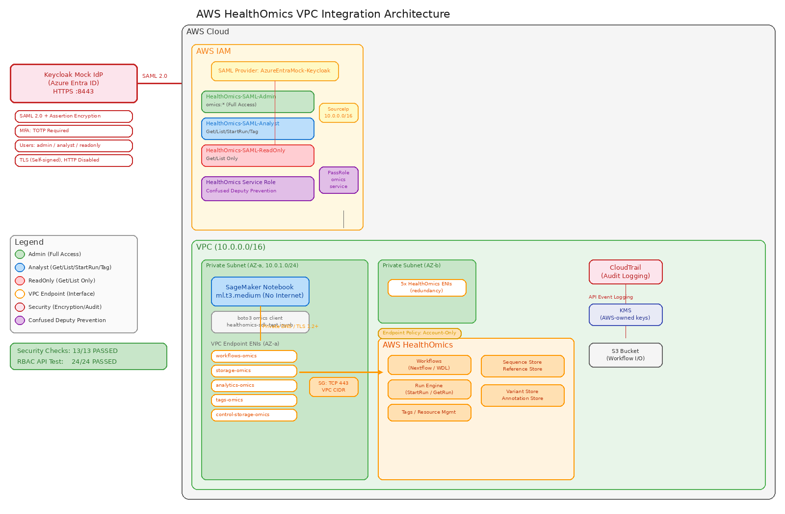

# AWS HealthOmics VPC Integration Demo

AWS HealthOmics를 VPC 프라이빗 환경에서 안전하게 운영하기 위한 통합 데모입니다.
Azure Entra ID 대신 Keycloak을 Mock IdP로 사용하여 SAML 2.0 페더레이션, MFA, RBAC를 검증합니다.

## Architecture



<details>
<summary>Text version</summary>

```
[Keycloak Mock IdP] --SAML 2.0 (HTTPS)--> [AWS IAM SAML Provider] --> [IAM Roles (3)]
   (TLS, port 8443)    (Assertion Encrypted)   (SourceIp restricted)    Admin/Analyst/ReadOnly
                                                                              |
[SageMaker Notebook] --Private Subnet--> [VPC Endpoints] --> [HealthOmics APIs]
     (ml.t3.medium)                      (5x Interface)      (Workflows/Storage/Analytics)
```
</details>

## Key Features

- **SAML 2.0 Federation** - Keycloak Mock IdP로 Azure Entra ID 시뮬레이션 (HTTPS, Assertion 암호화, 서명)
- **MFA 필수** - TOTP (Time-based One-Time Password) 인증 필수 적용
- **3단계 RBAC** - Admin / Analyst / ReadOnly 역할 분리 및 IAM 정책 세분화
- **VPC Private Networking** - 5개 HealthOmics Interface Endpoints, 인터넷 접근 차단
- **Confused Deputy Prevention** - `aws:SourceAccount` + `aws:SourceArn` 조건으로 크로스 서비스 보호
- **감사 추적** - CloudTrail로 모든 HealthOmics API 호출 기록

## Documents

| 파일 | 설명 |
|------|------|
| [setup-guide.md](setup-guide.md) | 전체 환경 구성 가이드 (Keycloak, AWS 인프라, IAM, SageMaker) |
| [validation-report.md](validation-report.md) | 보안 검증 보고서 (13개 체크리스트 + 실제 API RBAC 테스트 24건) |
| [healthomics-sdk-test.ipynb](healthomics-sdk-test.ipynb) | HealthOmics SDK 테스트 Jupyter 노트북 |

## Quick Start

### Prerequisites

- AWS 계정 (HealthOmics 서비스 접근 가능)
- Docker (Keycloak 실행용)
- AWS CLI v2
- VPC + Private Subnet 구성 완료

### 1. Keycloak Mock IdP 실행

```bash
# TLS 인증서 생성
mkdir -p keycloak-certs
openssl req -x509 -newkey rsa:2048 -keyout keycloak-certs/keycloak-tls-key.pem \
  -out keycloak-certs/keycloak-tls-cert.pem -days 365 -nodes \
  -subj "/CN=localhost"

# Keycloak 실행 (HTTPS only)
docker run -d --name keycloak \
  -p 8443:8443 \
  -v $(pwd)/keycloak-certs/keycloak-tls-cert.pem:/opt/keycloak/conf/server.crt.pem:ro \
  -v $(pwd)/keycloak-certs/keycloak-tls-key.pem:/opt/keycloak/conf/server.key.pem:ro \
  -e KC_BOOTSTRAP_ADMIN_USERNAME=admin \
  -e KC_BOOTSTRAP_ADMIN_PASSWORD=admin \
  -e KC_HOSTNAME=localhost \
  -e KC_HTTPS_CERTIFICATE_FILE=/opt/keycloak/conf/server.crt.pem \
  -e KC_HTTPS_CERTIFICATE_KEY_FILE=/opt/keycloak/conf/server.key.pem \
  quay.io/keycloak/keycloak:latest start --https-port=8443 --http-enabled=false
```

### 2. Keycloak Realm & SAML Client 구성

```bash
# Admin 토큰 획득
TOKEN=$(curl -sk -X POST https://localhost:8443/realms/master/protocol/openid-connect/token \
  -d 'grant_type=password&client_id=admin-cli&username=admin&password=admin' \
  | python3 -c 'import sys,json; print(json.load(sys.stdin)["access_token"])')

# Realm 생성
curl -sk -X POST https://localhost:8443/admin/realms \
  -H "Authorization: Bearer $TOKEN" \
  -H "Content-Type: application/json" \
  -d '{"realm":"azure-entra-mock","enabled":true,"sslRequired":"all"}'

# SAML Client 생성 (AWS용)
curl -sk -X POST https://localhost:8443/admin/realms/azure-entra-mock/clients \
  -H "Authorization: Bearer $TOKEN" \
  -H "Content-Type: application/json" \
  -d '{
    "clientId": "urn:amazon:webservices",
    "protocol": "saml",
    "enabled": true,
    "attributes": {
      "saml.encrypt": "true",
      "saml.server.signature": "true",
      "saml.assertion.signature": "true",
      "saml.force.post.binding": "true",
      "saml_assertion_consumer_url_post": "https://signin.aws.amazon.com/saml"
    }
  }'
```

자세한 구성 단계는 [setup-guide.md](setup-guide.md)를 참조하세요.

### 3. AWS 인프라 구성

```bash
# 변수 설정 (본인 환경에 맞게 수정)
export AWS_ACCOUNT_ID="123456789012"
export AWS_REGION="us-west-2"
export VPC_ID="vpc-xxxxxxxxx"
export PRIVATE_SUBNET_1="subnet-xxxxxxxxx"
export PRIVATE_SUBNET_2="subnet-xxxxxxxxx"

# IAM SAML Provider 등록
curl -sk https://localhost:8443/realms/azure-entra-mock/protocol/saml/descriptor \
  -o keycloak-saml-metadata.xml
aws iam create-saml-provider \
  --saml-metadata-document file://keycloak-saml-metadata.xml \
  --name AzureEntraMock-Keycloak

# HealthOmics VPC Endpoints 생성 (5개)
for SVC in workflows-omics storage-omics analytics-omics tags-omics control-storage-omics; do
  aws ec2 create-vpc-endpoint \
    --vpc-id $VPC_ID \
    --service-name com.amazonaws.${AWS_REGION}.${SVC} \
    --vpc-endpoint-type Interface \
    --subnet-ids $PRIVATE_SUBNET_1 $PRIVATE_SUBNET_2 \
    --private-dns-enabled \
    --region $AWS_REGION
done
```

### 4. RBAC 검증

```bash
# 각 역할별 실제 API 호출 테스트
# Admin: 전체 권한
# Analyst: Get/List/StartRun/Tag (Delete 불가)
# ReadOnly: Get/List만 가능

# 예시: Analyst 역할로 테스트
CREDS=$(aws sts assume-role \
  --role-arn arn:aws:iam::${AWS_ACCOUNT_ID}:role/HealthOmics-SAML-Analyst \
  --role-session-name rbac-test --output json)

export AWS_ACCESS_KEY_ID=$(echo $CREDS | python3 -c "import sys,json;print(json.load(sys.stdin)['Credentials']['AccessKeyId'])")
export AWS_SECRET_ACCESS_KEY=$(echo $CREDS | python3 -c "import sys,json;print(json.load(sys.stdin)['Credentials']['SecretAccessKey'])")
export AWS_SESSION_TOKEN=$(echo $CREDS | python3 -c "import sys,json;print(json.load(sys.stdin)['Credentials']['SessionToken'])")

aws omics list-workflows --region $AWS_REGION        # 허용
aws omics delete-workflow --id 1234 --region $AWS_REGION  # 거부 (AccessDeniedException)
```

## RBAC Permission Matrix

| API 작업 | Admin | Analyst | ReadOnly |
|----------|:-----:|:-------:|:--------:|
| ListWorkflows | O | O | O |
| ListRuns | O | O | O |
| GetWorkflow | O | O | O |
| ListSequenceStores | O | O | O |
| TagResource | O | O | X |
| StartRun | O | O | X |
| DeleteWorkflow | O | X | X |
| DeleteRun | O | X | X |

## Security Checklist (13/13 Passed)

- [x] HTTPS 전용 통신 (HTTP 비활성화)
- [x] MFA (TOTP) 필수 적용
- [x] 3단계 RBAC (Admin/Analyst/ReadOnly)
- [x] SourceIp 제한 (VPC CIDR만 허용)
- [x] SAML Assertion 암호화 + 서명
- [x] VPC Endpoint 경유 SDK 호출 (인터넷 차단)
- [x] VPC Endpoint 계정 제한 정책
- [x] CloudTrail 감사 로그
- [x] Security Group IP 화이트리스트
- [x] KMS 암호화 (저장 시/전송 시)
- [x] Confused Deputy 방지 조건
- [x] Analyst: StartRun 가능, 삭제 불가 (실제 API 테스트 검증)
- [x] ReadOnly: 조회만 가능 (실제 API 테스트 검증)

## AWS Documentation References

- [HealthOmics VPC Endpoints](https://docs.aws.amazon.com/omics/latest/dev/vpc-interface-endpoints.html)
- [HealthOmics IAM](https://docs.aws.amazon.com/omics/latest/dev/security_iam_service-with-iam.html)
- [HealthOmics Data Protection](https://docs.aws.amazon.com/omics/latest/dev/data-protection.html)
- [Confused Deputy Prevention](https://docs.aws.amazon.com/omics/latest/dev/cross-service-confused-deputy-prevention.html)

## License

This project is for demonstration and educational purposes.
